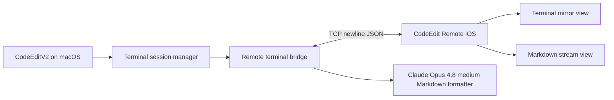

# CodeEdit Claude Companion

CodeEdit Claude Companion is an experimental productivity project that pairs a native macOS CodeEdit fork with an iOS companion app. The Mac app owns the real terminal sessions. The iPhone app connects to the Mac, mirrors live terminal output, sends command input, and renders a Claude-generated Markdown work stream from terminal activity.

This repository contains both sides:

- `CodeEdit/`: the macOS CodeEdit-based app, currently branded locally as `CodeEditV2`.
- `CodeEditRemoteiOS/`: the SwiftUI iOS companion client.

This is a personal side project and prototype, not an official CodeEdit release.

## What It Does

- Mirrors active Mac terminal sessions on iPhone.
- Sends command input from iPhone back to the selected Mac terminal.
- Supports Bonjour discovery on the local network.
- Saves local and detected public IP connection details for reconnect flows.
- Uses passcode-based pairing through the Mac app settings.
- Renders Markdown output on iOS with bundled local Markdown and math assets.
- Can ask Claude Opus 4.8 medium to convert the latest terminal increment into a Markdown stream entry.
- Can rewrite the full Markdown stream from a user prompt using a short-lived Claude Opus 4.8 medium invocation.

## Architecture



The Mac app remains the source of truth. The iOS app does not create a separate shell on the phone; it attaches to terminal sessions that exist in the Mac app.

## Security Model

This project is designed for personal use and trusted devices.

- Pairing uses a passcode configured on the Mac app.
- Bonjour discovery is used for local-network pairing.
- Direct IP reconnect can use a saved local IP or saved detected public IP.
- Public IP reconnect still requires a reachable network path such as VPN, Tailscale, router forwarding, or another secure tunnel.
- The Markdown Claude helper is launched from the Mac bridge with tool use disabled for formatting-only output; the bridge writes the returned Markdown text.

Do not expose the bridge directly to the public internet without a VPN or similar protection.

## Repository Layout

```text
CodeEdit/                         macOS app source
CodeEdit.xcodeproj/               macOS Xcode project
CodeEditRemoteiOS/                iOS companion app
CodeEditRemoteiOS/Shared/         protocol shared with the Mac bridge
CodeEditRemoteiOS/CodeEditRemoteiOS/MarkdownRenderer/
                                  local Markdown, sanitizer, and KaTeX assets
BUILD.md                          local build/install notes
LICENSE.md                        upstream MIT license
```

## Build

Build the macOS app:

```bash
xcodebuild -project CodeEdit.xcodeproj \
  -scheme CodeEdit \
  -configuration Debug \
  -destination 'generic/platform=macOS' \
  build
```

Build the iOS companion app:

```bash
xcodebuild -project CodeEditRemoteiOS/CodeEditRemoteiOS.xcodeproj \
  -scheme CodeEditRemoteiOS \
  -configuration Debug \
  -destination 'generic/platform=iOS Simulator' \
  build
```

See `BUILD.md` for local install notes for `/Applications/CodeEditV2.app`.

## Current Status

The prototype currently focuses on two iOS surfaces:

- Terminal: a compact mirror of the selected Mac terminal session.
- MD Stream: a rendered Markdown stream generated from terminal output, with optional full-file rewrite.

The project is useful as a local productivity experiment and as a demonstration of native Apple-platform engineering across macOS, iOS, networking, terminal streaming, and AI-assisted documentation.

## Attribution

This project is built on top of the open-source CodeEdit project.

- Upstream project: https://github.com/CodeEditApp/CodeEdit
- Upstream license: MIT, preserved in `LICENSE.md`

This repository is not affiliated with or endorsed by the CodeEdit project.
